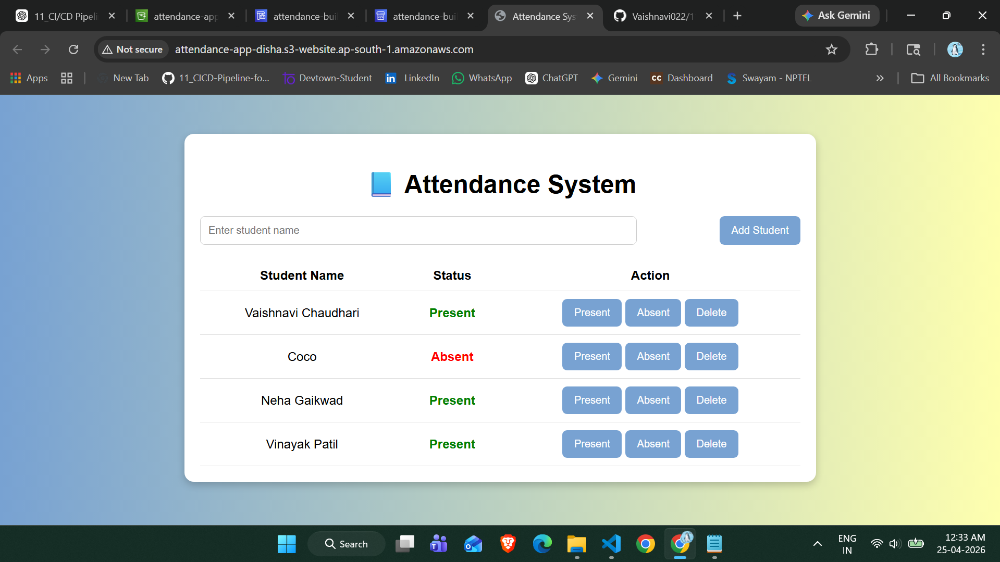

# 🚀 CI/CD Pipeline for Attendance Application

## 📌 Project Overview

This project demonstrates the implementation of a **CI/CD (Continuous Integration & Continuous Deployment) pipeline** using AWS services.

The Attendance Web Application is automatically deployed to Amazon S3 whenever changes are pushed to the GitHub repository. This removes the need for manual deployment and ensures faster and more reliable updates.

---

## 🎯 Objective

* Automate deployment of a static attendance web application
* Implement a complete CI/CD pipeline using AWS
* Enable automatic updates on every GitHub push

---

## 🧰 AWS Services Used

* AWS CodePipeline → Automates the CI/CD workflow
* AWS CodeBuild → Handles the build stage (for demonstration)
* Amazon S3 → Hosts the static website

---

## 🧱 Architecture

GitHub → CodePipeline → CodeBuild → S3 → Live Website

---
## ⚙️ Step-by-Step Implementation

### 🔹 Step 1: Create S3 Bucket

* Created an S3 bucket named `attendance-app-disha`
* Enabled static website hosting
* Set index document as `index.html`
* Configured bucket policy to allow public access

---

### 🔹 Step 2: Upload Project Files

* Uploaded project files to GitHub:

  * index.html
  * style.css
  * script.js
  * buildspec.yml

---

### 🔹 Step 3: Setup CodePipeline

* Created pipeline named `attendance-pipeline`
* Connected GitHub repository
* Selected branch: `main`

---

### 🔹 Step 4: Configure CodeBuild

* Created build project named `attendance-build`
* Used `buildspec.yml` file
* Selected Ubuntu environment with standard runtime

---

### 🔹 Step 5: Deploy to S3

* Deployment provider: Amazon S3
* Selected bucket: `attendance-app-disha`
* Enabled “Extract file before deploy”

---

### 🔹 Step 6: Test CI/CD Pipeline

* Made changes in the project code
* Pushed changes to GitHub
* CodePipeline triggered automatically
* Website updated successfully

---

## 🌐 Final Output

---

## 📌 Important Notes

* `images/placeholder.txt` is added to ensure the images folder is tracked in GitHub
* This project uses a static website, so the build stage is optional
* CodeBuild is included for demonstration of a complete CI/CD pipeline

---

## 💡 Key Learnings

* Understanding CI/CD concepts
* Automating deployment using AWS CodePipeline
* Hosting static websites on Amazon S3
* Integrating GitHub with AWS services

---

## 🎉 Conclusion

This project successfully demonstrates an automated CI/CD pipeline where any change pushed to GitHub is automatically deployed to a live website hosted on Amazon S3.

---
